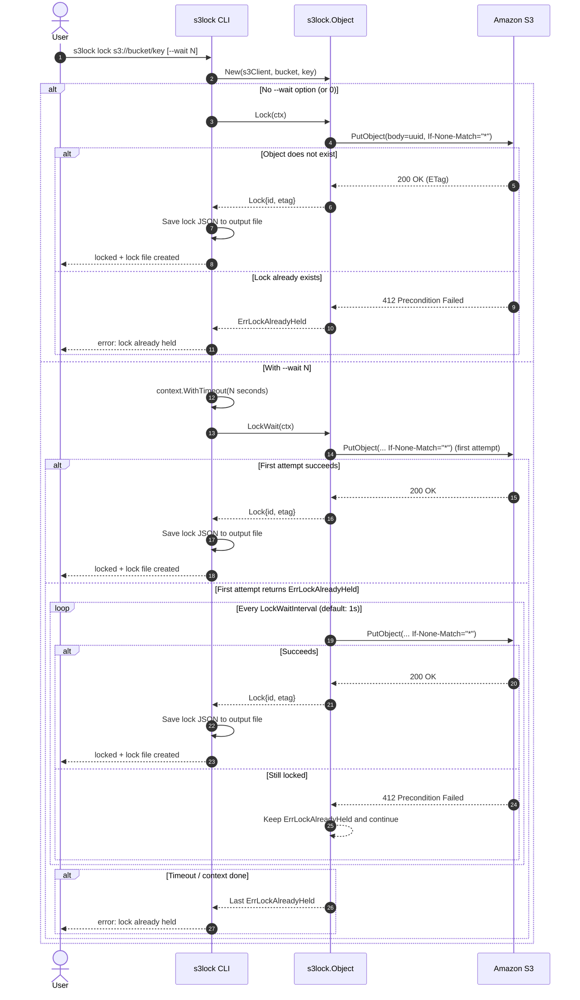

# s3lock

[](https://github.com/winebarrel/s3lock/actions/workflows/ci.yml)
[](https://pkg.go.dev/github.com/winebarrel/s3lock)

s3lock is a locking command using S3.

Exclusive control is implemented using [conditional writes](https://docs.aws.amazon.com/AmazonS3/latest/userguide/conditional-writes.html).

```sh
$ s3lock lock s3://my-bucket/lock-object
s3://my-bucket/lock-object has been locked
create lock-object.lock

# A locked object cannot be double-locked
$ s3lock lock s3://my-bucket/lock-object
s3lock: error: lock already held

$ s3lock unlock lock-object.lock
s3://my-bucket/lock-object has been unlocked
delete lock-object.lock
```

## Lock Sequence



## Installation

```
brew install winebarrel/s3lock/s3lock
```

## Usage

```
Usage: s3lock <command> [flags]

Flags:
  -h, --help       Show context-sensitive help.
      --version

Commands:
  lock <s3-url> [flags]

  unlock <lock-file> [flags]

Run "s3lock <command> --help" for more information on a command.
```

<details>

<summary>s3lock lock</summary>

```
Usage: s3lock lock <s3-url> [flags]

Arguments:
  <s3-url>    S3 URL of the object to lock, e.g., s3://bucket/lock-obj-key

Flags:
  -h, --help             Show context-sensitive help.
      --version

  -w, --wait=UINT        Fail if the lock cannot be acquired within seconds.
  -o, --output=STRING    Lock file output path. (default: <lock-obj-key>.lock)
```

</details>
<details>

<summary>s3lock unlock</summary>

```
Usage: s3lock unlock <lock-file> [flags]

Arguments:
  <lock-file>    Lock file path.

Flags:
  -h, --help       Show context-sensitive help.
      --version
```

</details>

### Use as a library

```go
package main

import (
	"context"
	"log"

	"github.com/aws/aws-sdk-go-v2/config"
	"github.com/aws/aws-sdk-go-v2/service/s3"
	"github.com/winebarrel/s3lock"
)

func main() {
	ctx := context.Background()

	cfg, _ := config.LoadDefaultConfig(ctx)
	s3cli := s3.NewFromConfig(cfg)

	obj := s3lock.New(s3cli, "my-bucket", "lock-object")
	lock, err := obj.Lock(ctx)

	if err != nil {
		log.Fatal(err)
	}

	defer lock.Unlock()

	// ...
}
```
